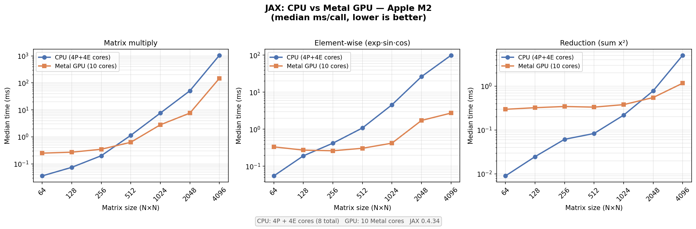

# ROS + JAX on macOS — Experiments

Exploration of running JAX (and eventually ROS) natively on macOS with Apple Silicon.

---

## Do ROS and JAX work on macOS?

Short answer: partially, and with caveats.

### JAX

- **CPU**: works out of the box via `pip install jax`.
- **Apple Silicon GPU (Metal)**: works via the `jax-metal` plugin, but the plugin
  lags behind JAX releases. See the version pinning section below.
- **CUDA GPU**: not available on macOS; Linux + CUDA remains the gold standard
  for GPU-heavy JAX workloads.

### ROS

- **ROS 1** (Noetic etc.): community-supported on macOS only, always fragile.
- **ROS 2** (Humble, Iron, Jazzy): listed as Tier 3 (minimally tested); recent
  distributions have been dropping macOS support. Apple Silicon adds further
  friction due to ARM binary mismatches.
- **Practical recommendation**: use the official ROS Docker images or a Linux VM.
  Native macOS ROS is a time sink for serious work.

---

## Environment

| Component | Version |
|-----------|---------|
| Hardware | MacBook M2 |
| macOS | Darwin 25.3 (macOS 16) |
| Python | 3.12 (Homebrew) |
| JAX | 0.4.34 |
| jaxlib | 0.4.34 |
| jax-metal | 0.1.1 |

---

## Critical: JAX version pinning

`jax-metal 0.1.1` requires **JAX 0.4.x**. Installing the latest JAX (0.10+ as of
April 2026) breaks the Metal backend with:

```
UNIMPLEMENTED: default_memory_space is not supported.
```

JAX 0.10 added a `default_memory_space` requirement to its plugin API that
`jax-metal 0.1.1` has not implemented. Always install:

```
jax==0.4.34
jaxlib==0.4.34
jax-metal==0.1.1
```

---

## Setup

### Prerequisites

- **macOS on Apple Silicon** (M1 or later)
- **Python 3.12** via Homebrew — do not use the system Python or Python 3.14+,
  as JAX wheels may not exist for very new versions:

  ```bash
  brew install python@3.12
  ```

- **Xcode Command Line Tools** (needed by Homebrew and some Python packages):

  ```bash
  xcode-select --install
  ```

### Get the code

```bash
git clone <repo-url>
cd ros-jax-experiments
```

### Install dependencies

```bash
make install
```

This creates a `.venv/` virtual environment using Python 3.12 and installs all
pinned dependencies from `requirements.txt`. You only need to do this once.

### Available commands

| Command | What it does |
|---------|-------------|
| `make install` | Create `.venv` and install pinned dependencies |
| `make test` | Correctness checks + quick CPU vs Metal timing table |
| `make benchmark` | Full size sweep — saves `benchmark.png` |
| `make clean` | Delete `.venv` (re-run `make install` to start fresh) |

### Running manually (without make)

```bash
python3.12 -m venv .venv
.venv/bin/pip install -r requirements.txt

.venv/bin/python jax_test.py       # correctness + quick benchmark
.venv/bin/python benchmark_plot.py # full benchmark → benchmark.png
```

### Expected output

`make test` prints a correctness check followed by a timing table:

```
JAX 0.4.34  |  cpu: TFRT_CPU_0  |  metal: METAL:0

=== Correctness ===
[1] arange + sum    : [1. 2. 3. 4. 5.]  sum=15.0
[2] autograd        : grad=[-4. -2.  2.]  (expected [-4, -2, 2])
[3] vmap            : (8, 4) · (4,) -> (8,)

=== CPU vs Metal benchmark (median ms/call) ===
...
```

`make benchmark` prints progress as it runs and writes `benchmark.png` when done.
The chart title and hardware footer are auto-discovered from your machine —
no editing needed to run on a different chip.

---

## CPU vs Metal GPU benchmark results (M2, April 2026)

Median wall-clock time per call after JIT warmup. Speedup = CPU ms / Metal ms.

### Matrix multiply (`jnp.dot(A, A)`)

| Shape | CPU (ms) | Metal (ms) | Speedup |
|-------|----------|------------|---------|
| 256×256 | 0.21 | 0.32 | 0.7× (CPU faster) |
| 1024×1024 | 9.10 | 1.18 | **7.7×** |
| 4096×4096 | 1078.74 | 160.13 | **6.7×** |

### Element-wise (`exp(sin(x) + cos(x))`)

| Shape | CPU (ms) | Metal (ms) | Speedup |
|-------|----------|------------|---------|
| 256×256 | 0.42 | 0.27 | 1.5× |
| 1024×1024 | 4.96 | 0.46 | **10.8×** |
| 4096×4096 | 103.41 | 2.68 | **38.6×** |

### Reduction (`sum(x²)`)

| Shape | CPU (ms) | Metal (ms) | Speedup |
|-------|----------|------------|---------|
| 256×256 | 0.07 | 0.36 | 0.2× (CPU faster) |
| 1024×1024 | 0.62 | 0.62 | 1.0× |
| 4096×4096 | 9.26 | 2.01 | **4.6×** |

### Key takeaways

1. **Metal has non-trivial dispatch overhead.** For small arrays (≤256×256),
   CPU is often faster because kernel launch cost exceeds compute time.
2. **The crossover is around 1024×1024.** Above that, Metal wins decisively.
3. **Element-wise ops scale best on Metal** (38× at 4096²) because they are
   embarrassingly parallel with no inter-thread communication.
4. **Reductions are less impressive** on Metal because they require tree-reduction
   across cores; the CPU's cache hierarchy helps for smaller inputs.
5. **Robotics implication**: small state vectors and real-time control loops
   favour CPU. Bulk sensor processing or neural network training favours Metal.

---

## Performance chart



Generated by `make benchmark`. Both axes are log scale. Key observations:

- **Matrix multiply**: crossover at ~512×512; Metal ~7× faster at 4096².
- **Element-wise**: Metal's dispatch floor is nearly flat 128–512 while CPU scales linearly; Metal wins from ~256 onwards and is ~37× faster at 4096².
- **Reduction**: CPU faster up to ~2048×2048 because reductions aren't embarrassingly parallel; Metal only edges ahead at the largest sizes.

## Project layout

```
.
├── README.md            # this file
├── Makefile             # install / test / benchmark / clean targets
├── requirements.txt     # pinned dependencies
├── jax_test.py          # correctness checks + quick CPU vs Metal table
├── benchmark_plot.py    # full sweep across sizes, saves benchmark.png
└── benchmark.png        # latest generated chart
```
